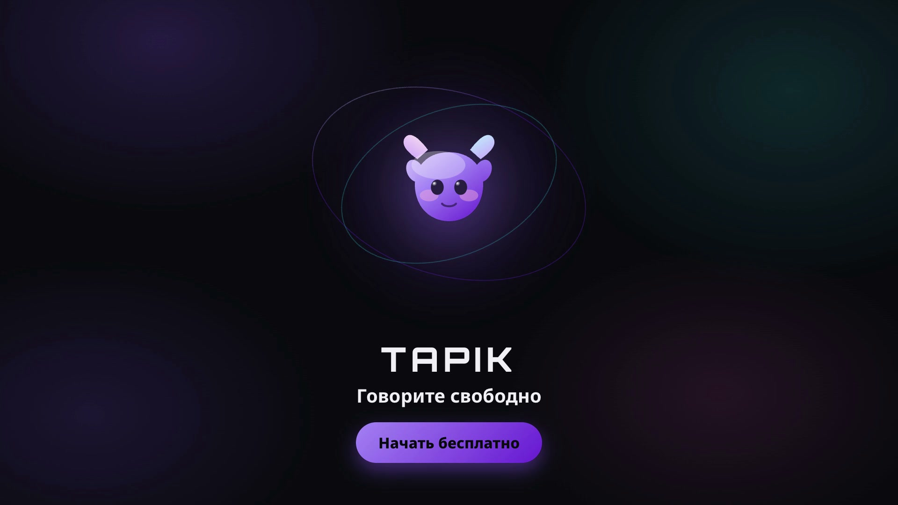
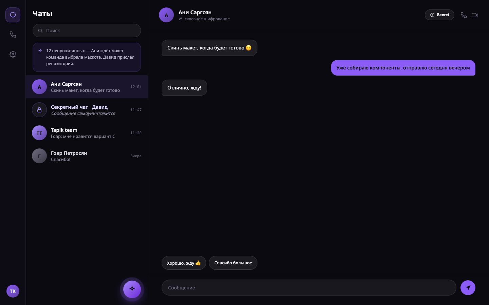
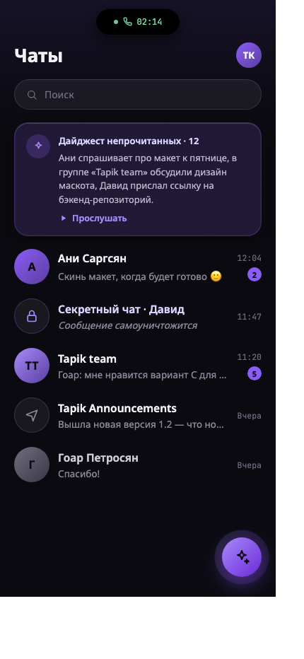
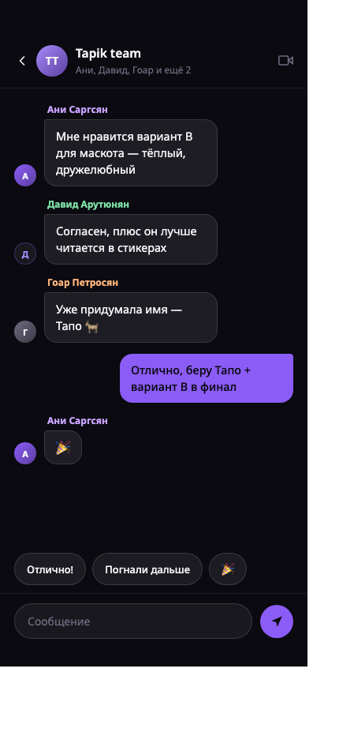

<div align="center">
  

  <br>

  
  
  
  
  
  
  

  8 микросервисов · Мессенджер с realtime-доставкой, ИИ-автоответчиком и push-уведомлениями
</div>

## Интерфейс

<table>
<tr>
<td width="60%"></td>
<td width="20%"></td>
<td width="20%"></td>
</tr>
</table>

## Архитектура

```
                    HTTP (JWT)                  WebSocket (JWT в handshake)
Клиент ─────────────────────────▶┐        ┌────────────────────────────▶┐
                                   │        │                             │
                              ┌────▼────────▼────┐         Redis adapter  │
                              │    ChatService     │◀───(multi-instance)──┘
                              └──┬───────┬───────┬─┘
             gRPC (x-internal-key)│      │RabbitMQ│ gRPC-клиент (x-internal-key)
        ┌──────────────────────┘        │        └───────────────────┐
        ▼                                ▼                            ▼
AIAssistantService,               NotificationService,          MediaService ──▶ ImageProxyService
ReactionsService                  ReactionsService (delivery)         │
                                                                       ▼
                                                                  UserService
                                                                       ▲
                                                                  AuthService (user.registered)
```

Сервисы общаются между собой по gRPC (запрос-ответ, за shared-secret заголовком `x-internal-key`) и RabbitMQ (события, publish/subscribe). У каждого своя база данных — ScyllaDB/Cassandra там, где важен write-throughput (сообщения, реакции), PostgreSQL через Prisma там, где нужны привычные реляционные гарантии (профили, токены, файлы, отложенные сообщения).

## Сервисы

| Сервис | Репозиторий | Роль |
|---|---|---|
| **AuthService** | [TapikLab/AuthService](https://github.com/TapikLab/AuthService) | Регистрация, вход, OAuth (Google/GitHub), 2FA (TOTP), ротация refresh-токенов |
| **UserService** | [TapikLab/UserService](https://github.com/TapikLab/UserService) | Профили пользователей: имя, био, аватар |
| **ChatService** | [TapikLab/ChatService](https://github.com/TapikLab/ChatService) | Чаты, сообщения, realtime-доставка по WebSocket, статусы прочтения |
| **ReactionsService** | [TapikLab/ReactionsService](https://github.com/TapikLab/ReactionsService) | Реакции (эмодзи) на сообщения |
| **MediaService** | [TapikLab/MediaService](https://github.com/TapikLab/MediaService) | Загрузка файлов в S3-хранилище, дедупликация, верификация вложений |
| **ImageProxyService** | [TapikLab/ImageProxyService](https://github.com/TapikLab/ImageProxyService) | Обработка изображений: превью, миниатюры, аватары |
| **NotificationService** | [TapikLab/NotificationService](https://github.com/TapikLab/NotificationService) | Push-уведомления офлайн-пользователям |
| **AIAssistantService** | [TapikLab/AIAssistantService](https://github.com/TapikLab/AIAssistantService) | ИИ-подсказки для ответа, отложенная отправка, авто-ответ в стиле пользователя |

## Стек

**Backend:** NestJS 11, TypeScript
**Данные:** ScyllaDB/Cassandra, PostgreSQL (Prisma), Redis
**Обмен между сервисами:** gRPC, RabbitMQ
**Realtime:** Socket.IO (Redis adapter для горизонтального масштабирования)
**Хранилище файлов:** S3-совместимое (MinIO)
**LLM:** Groq API / self-hosted Ollama
